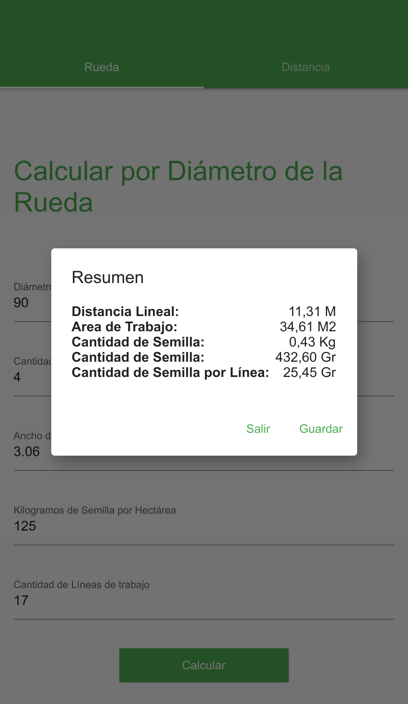

# Calibrar Sembradora

## Descripción

Aplicacion destinada a ayudar a calibrar sembradoras, desarrollada por ZootecniaRural.

## Capturas
### Calcular gramos por lineas utilizando giros de la rueda

### Calcular gramos por lineas utilizando una distancia conocida

### Resultado del calculo

